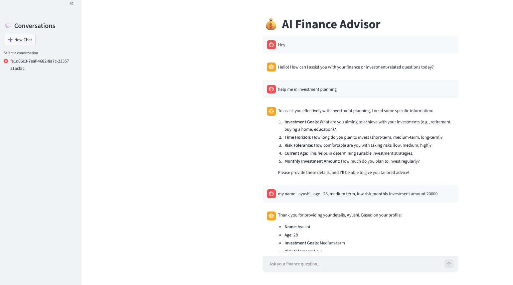
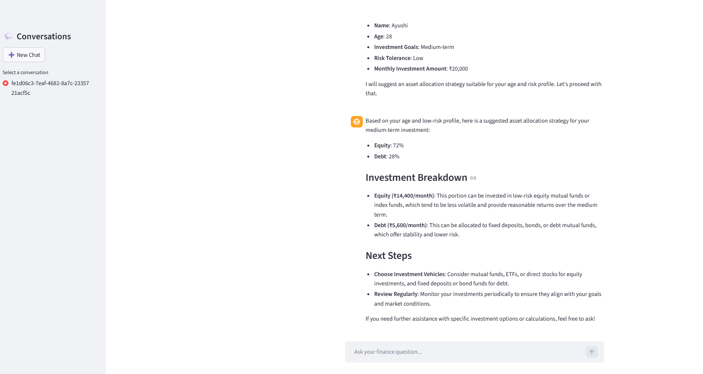

# 💰 AI Finance Advisor  
**Agentic RAG + Tool-Oriented Financial Planning System**

An end-to-end **production-style AI financial advisory system** built using modern agentic AI architecture.  
This is **not a chatbot** — it is a **stateful, tool-driven, observable AI system** designed using real-world SaaS patterns.

---




---
## 🚀 Tech Stack

**Backend & AI**
- FastAPI (Streaming API)
- LangGraph (Agent orchestration & state machine)
- LangChain (Tools, RAG, memory integration)
- OpenRouter / OpenAI-compatible LLM
- FAISS (Vector store for RAG)

**State & Memory**
- PostgreSQL (Persistent conversation & agent state)
- LangGraph Postgres Checkpointer

**Frontend**
- Streamlit (Chat UI, multi-thread support)

**Observability**
- LangSmith (Tracing, tool visibility, token usage)

**Infrastructure**
- Docker & Docker Compose (Multi-service architecture)

---

## 🎯 What This Project Does

The **AI Finance Advisor** can:

- Understand and persist user financial profile  
- Maintain multi-turn, multi-session conversations  
- Perform deterministic financial calculations  
- Calculate EMI, SIP, retirement corpus, emergency fund  
- Perform risk profiling and asset allocation  
- Retrieve finance knowledge using RAG  
- Maintain long-term state using PostgreSQL  
- Stream responses in real time  
- Expose full execution traces via LangSmith  

---

## 🏗️ System Architecture

```
Streamlit UI
     │
     ▼
FastAPI Backend (Streaming)
     │
     ▼
LangGraph Agent
     │
     ├── Financial Tools
     ├── RAG (FAISS)
     └── State Updaters
     │
     ▼
PostgreSQL (Checkpointer Memory)
     │
     ▼
LLM (OpenRouter / OpenAI-compatible)
```

---

## 🧠 Agent Workflow

```
persist_user
      │
      ▼
    agent
      │
      ├── tool required → tools
      │                     │
      │                     ▼
      │               persist_risk
      │                     │
      └─────────────────────┘
```

---

## 🛠 Financial Tools

- SIP Calculator  
- EMI Calculator  
- Retirement Corpus Calculator  
- Emergency Fund Calculator  
- Asset Allocation Tool  
- Risk Profiling Tool  
- Finance RAG Tool  

All numeric outputs are **tool-generated and deterministic**.

---

## 📚 RAG (Retrieval-Augmented Generation)

- FAISS vector store  
- OpenAI embeddings (`text-embedding-3-small`)  
- Domain-based filtering  
- Used only for conceptual explanations  

---

## 💾 Persistent Memory

- PostgreSQL-backed LangGraph Checkpointer  
- Thread-based conversation isolation  
- Crash-safe recovery  
- Stateful financial planning  

---

## 🌐 API Endpoints

### Stream Chat
```
POST /chat/stream
```

### List Threads
```
GET /threads
```

### Load History
```
GET /history/{thread_id}
```

---

## 🐳 Docker Setup

Run everything:
```
docker compose up --build
```

Access:
- Streamlit → http://localhost:8501  
- FastAPI → http://localhost:8000  

---

## 📊 Observability

LangSmith enabled for:
- Full graph tracing  
- Tool call visibility  
- Token usage analysis  

---

## 📁 Project Structure

```
AI-FINANCE-ADVISOR-AGENT/
│
├── agent/
│   ├── graph.py
│   ├── state.py
│   └── nodes/
│       ├── agent_node.py
│       ├── user_profile_state_updater.py
│       └── risk_state_updater.py
│
├── api/
│   └── main.py
│
├── llm/
│   ├── llm_provider.py
│   └── prompts.py
│
├── memory/
│   └── checkpointer.py
│
├── rag/
│   ├── ingest.py
│   ├── retriever.py
│   ├── data/
│   └── vectorstore/
│
├── tools/
│   ├── sip_calculator.py
│   ├── emi_calculator.py
│   ├── retirement_calculator.py
│   ├── emergency_fund_calculator.py
│   ├── asset_allocation_tool.py
│   └── risk_profile_tool.py
│
├── streamlit_app/
│   ├── app.py
│   └── Dockerfile
│
├── docker-compose.yml
├── Dockerfile
├── requirements.txt
└── .env

```

---

## 📈 Future Enhancements

- Authentication
- Redis caching
- Portfolio visualization
- Cloud deployment
- CI/CD pipeline

---

## 🎯 Why This Project Matters

This project demonstrates **real-world AI system design**:

- Agentic workflows  
- Deterministic tool orchestration  
- Persistent memory  
- RAG integration  
- Streaming infrastructure  
- Production-grade observability  

---

⭐ If you found this useful, star the repository and build your own agentic AI systems.
